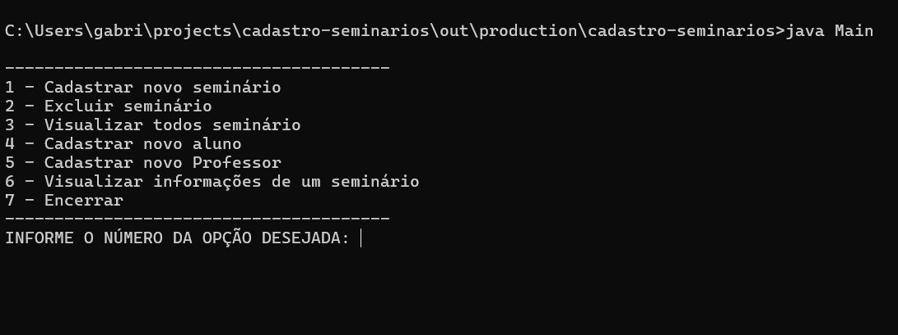
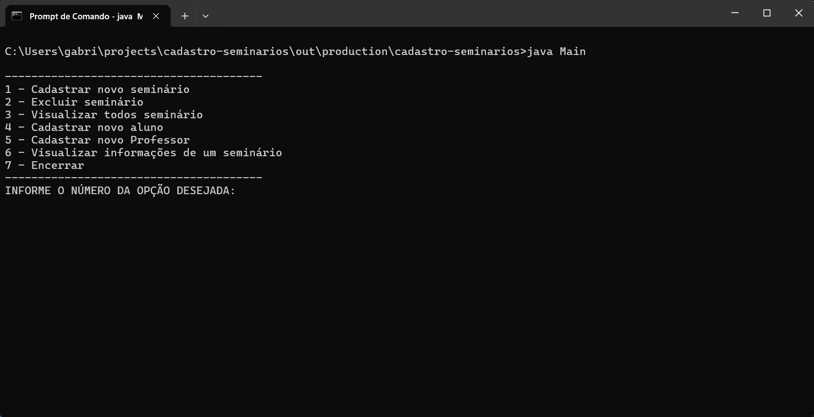

# Cadastro seminários

## Descrição
Aplicação simples de linha de comando (CLI) para cadastro de seminários.
Os usuários podem adicionar, listar e remover seminários, incluindo informações como título,
alunos, professores ministrante e local. O sistema inclui regras de negócio para validar os dados, como evitar que
alunos estejam presentes simultâneamente em seminários.

## Observações:
> ⚠️ **Atenção:** O código pode conter bugs, pois não corrigi todas as exceções que podem surgir na interação com
> o terminal (CLI)

Projeto desenvolvido para fins didáticos, visando a aplicação prática de conceitos e técnicas aprendidos
durante estudos, tais como:
 - Orientação a objetos
 - Exceções
 - Associação de classes (relacionamentos)
 - Boas práticas de código
 - Padrões de commit

## Funcionalidades
- `Funcionalidade 1:` Gerenciar seminários (Criar, visualizar e deletar)
- `Funcionalidade 2:` Cadastrar alunos em seminários existentes
- `Funcionalidade 3:` Cadastrar professores em seminários existentes

## Aplicação

## ✔️ Tecnologias e técnicas utilizadas
- ``JAVA 8``

## Como executar o projeto
